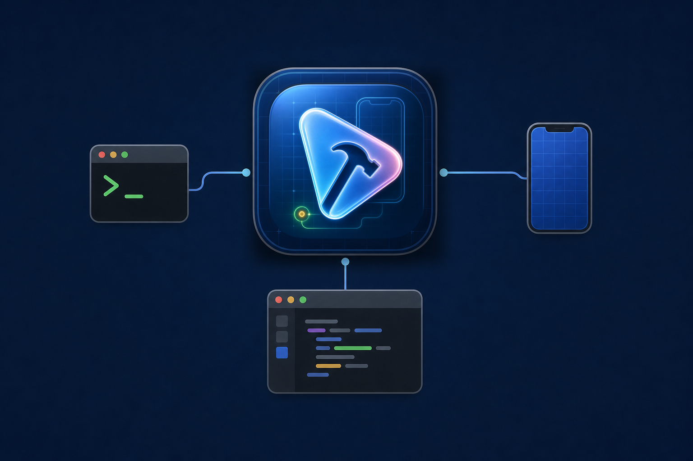

# Xcoder



Xcoder is a local-first Codex plugin for Xcode workflows. It gives Codex one stable command, `bin/xcode`, for build/test planning, simulator control, result summaries, warning audits, IDE automation, environment diagnostics, and optional native macOS/Xcode state sensing.

It does not depend on XcodeBuildMCP. It uses Apple tools directly: `xcodebuild`, `xcrun simctl`, `xcrun xcresulttool`, `osascript`/JXA, Xcode scripting, and a small optional Swift helper for native app state and read-only Accessibility inspection.

## Install

Clone the repo:

```bash
git clone git@github.com:AmrMohamad/Xcoder.git /Users/amrmohamad/Developer/Xcoder
cd /Users/amrmohamad/Developer/Xcoder
chmod +x bin/xcode
bin/xcode --version
bin/xcode doctor --json
```

Register it in your local plugin marketplace without overwriting existing entries. A typical entry is:

```json
{
  "name": "xcode",
  "path": "/Users/amrmohamad/Developer/Xcoder",
  "category": "Developer Tools"
}
```

If your marketplace expects a relative path from `/Users/amrmohamad`, use:

```json
{
  "name": "xcode",
  "path": "./Developer/Xcoder",
  "category": "Developer Tools"
}
```

See [Installation](docs/installation.md) for cache install, validation, and optional Swift helper rebuild steps.

## Quick Use

```bash
bin/xcode --help
bin/xcode --version --json
bin/xcode doctor --json
bin/xcode context --path App.xcodeproj --scheme App --json
bin/xcode simulator resolve --name "iPhone SE (3rd generation)" --runtime "iOS 18.5" --json
bin/xcode build --project App.xcodeproj --scheme App --destination 'platform=iOS Simulator,id=<UDID>' --action build --dry-run --json
```

Package a clean plugin zip:

```bash
bin/xcode package zip --output /tmp/xcode-plugin-0.3.0.zip --json
bin/xcode package audit --zip /tmp/xcode-plugin-0.3.0.zip --json
```

## What It Provides

- `xcode-build-cache`: shared DerivedData and SwiftPM cache wrapper around `xcodebuild`.
- `xcode-context`: read-only project, scheme, destination, and testability guidance.
- `xcode-simulator`: `simctl` list, resolve, prepare, boot, install, launch, screenshot, terminate, and shutdown flows.
- `xcode-results`: normalized `xcresulttool` summaries.
- `xcode-warning-audit`: xcodebuild warning and error summaries.
- `xcode-doctor`: local Xcode/toolchain/plugin checks.
- `xcode-ide-automation`: AppleScript/JXA control of the open Xcode app for IDE-specific actions.
- `xcode-native-helper`: optional Swift helper for Xcode process state, installed Xcode discovery, permission status, workspace opening, and read-only AX window/modal inspection.
- `xcode-workflows`: guidance for choosing CLI, simulator, IDE, native helper, or results flows.

## Contract

Every command reachable through `bin/xcode` emits the same JSON envelope:

```json
{
  "schema_version": "xcode-plugin.v0.3",
  "ok": true,
  "status": "success",
  "error_type": null,
  "command_name": "doctor",
  "summary": {},
  "artifacts": {},
  "warnings": [],
  "errors": [],
  "next_actions": []
}
```

Large logs, screenshots, diagnostics, and `.xcresult` data stay on disk. Responses return local artifact paths instead of dumping raw build output into chat.

## Documentation

- [Installation](docs/installation.md)
- [Architecture](docs/architecture.md)
- [Workflows](docs/workflows.md)
- [Validation](docs/validation.md)

## Important Boundaries

- Default build/test path is `xcodebuild`, not AppleScript.
- IDE automation is only for open Xcode state and IDE-specific actions.
- Simulator commands prefer UDIDs. Name aliases must resolve uniquely first.
- `trusted-fast` requires an explicit trust reason because skipping package plugin and macro validation is security-sensitive.
- The Swift helper is optional and diagnostic-first. It must not run builds, run simulators, parse `.xcresult`, click UI, select schemes, or select destinations.
- Apple `mcpbridge` is optional.
