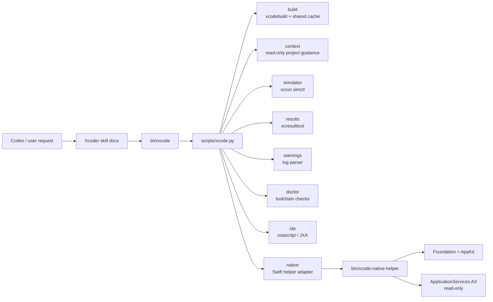
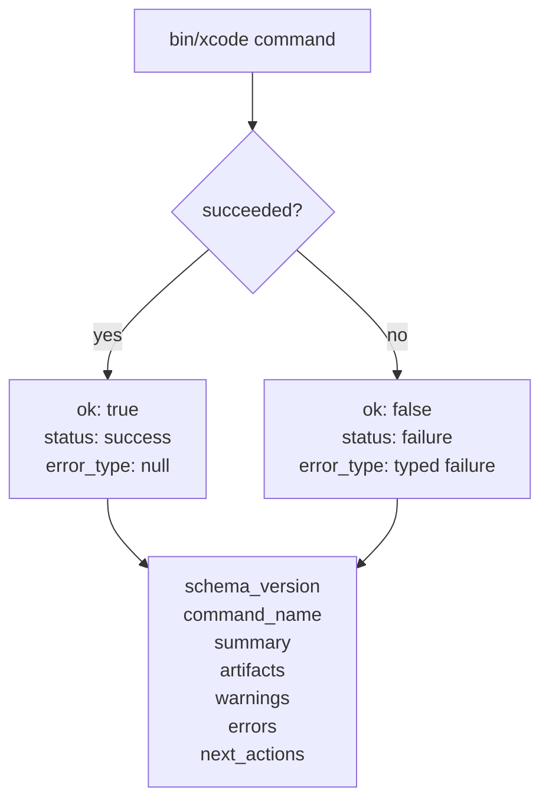
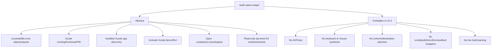
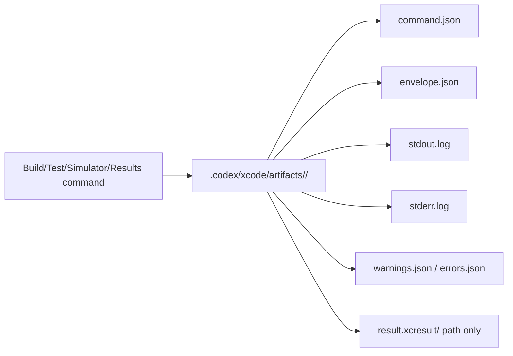

# Architecture


Xcoder keeps Python as the public contract owner. Swift is only an optional native helper for macOS/Xcode state where Python and JXA are weaker.

## Command Flow



## JSON Envelope

All public commands return one shape.



This gives Codex predictable control flow. It can inspect `ok`, `error_type`, `artifacts`, and `next_actions` without scraping prose.

## Native Helper Boundary



The helper emits `xcode-native-helper.v0.1`. The Python adapter normalizes that into the plugin envelope `xcode-plugin.v0.3`.

## Artifact Policy



Raw logs and result bundles are local artifacts. Chat responses should reference paths, not paste large logs.

## Cache Safety

`trusted-fast` is explicit because it can skip package plugin and macro validation. It requires:

```bash
--trusted-fast --trust-reason "..."
```

The build cache identity includes the trusted-fast state, Xcode version, scheme, configuration, and project path hash. A cache metadata mismatch fails instead of reusing silently.

