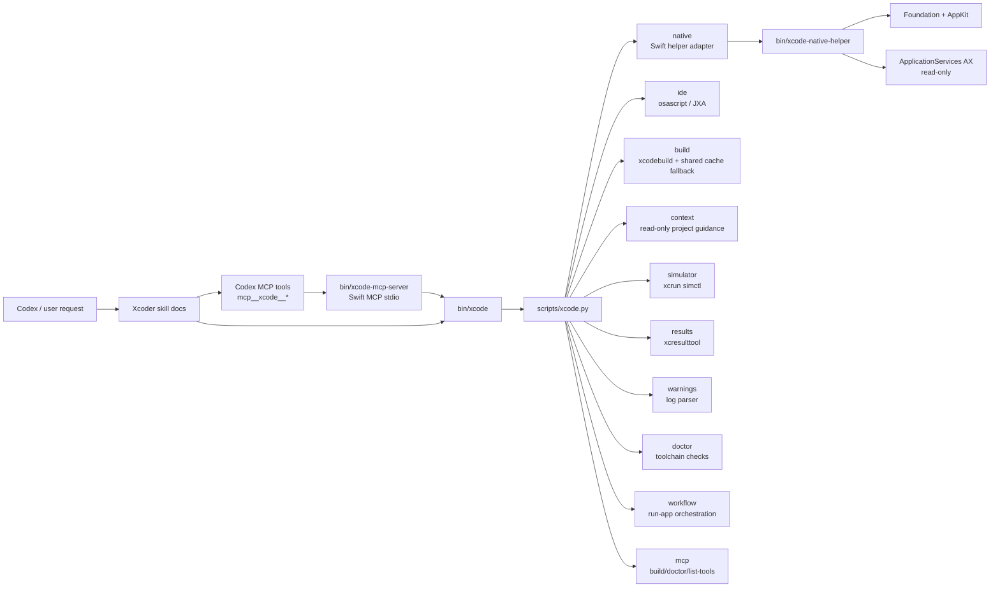
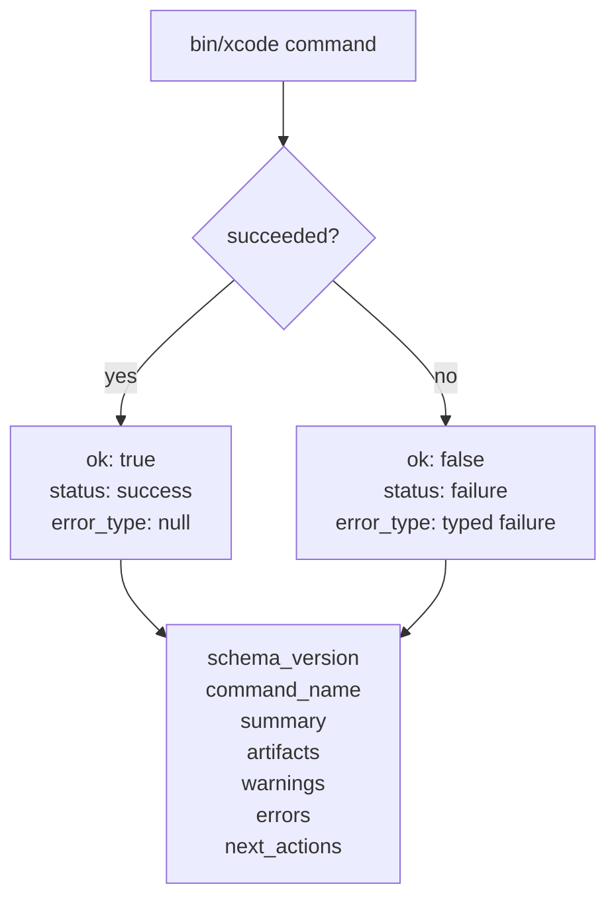
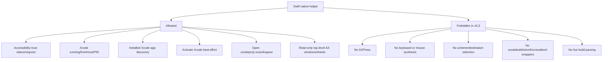
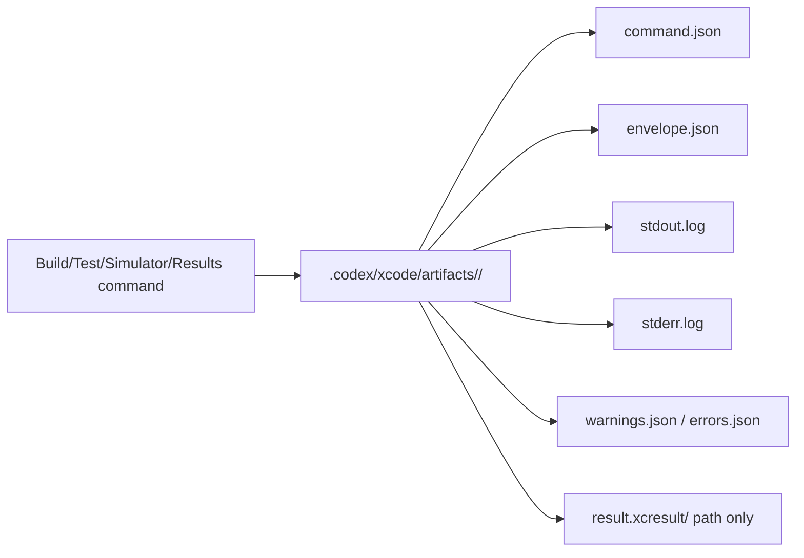

# Architecture


Xcoder keeps Python as the public contract owner. Swift is used in two narrow places: an optional native helper for macOS/Xcode state where Python and JXA are weaker, and a bundled MCP server that exposes callable tools while delegating all real work to `bin/xcode`.

Explicit plugin invocation is GUI-first: when the user mentions `@xcode`, the agent should inspect and control Xcode.app through `bin/xcode native ...` and `bin/xcode ide ...` before considering plugin-routed CLI fallback.

## Command Flow



## JSON Envelope

All public commands return one shape.



This gives Codex predictable control flow. It can inspect `ok`, `error_type`, `artifacts`, and `next_actions` without scraping prose.

## Native Helper Boundary



The helper emits `xcode-native-helper.v0.1`. The Python adapter normalizes that into the plugin envelope `xcode-plugin.v0.3`.

## MCP Server Boundary

`native/XcodeMCPServer` uses `modelcontextprotocol/swift-sdk` pinned through `Package.resolved`. It is built as a macOS 14+ executable and shipped as `bin/xcode-mcp-server`; runtime startup goes through `bin/xcode-mcp`, which checks the host macOS version before executing the Swift binary. It exposes exactly the first typed Xcode tools:

```text
xcode_doctor
xcode_native_state
xcode_native_windows
xcode_ide_preflight
xcode_ide_build
xcode_ide_run
xcode_run_app
xcode_simulator_resolve
xcode_results_summary
xcode_warnings_summary
```

The server is intentionally thin. It validates typed arguments, rejects free-form execution keys such as `command`, `shell`, `args`, `script`, and `raw`, runs `bin/xcode` through `Process` direct argv, enforces MCP-side timeouts, and returns the existing `xcode-plugin.v0.3` envelope as JSON text. It must not call Apple developer tools directly.

Minimum OS policy:

```text
minimum macOS for Swift native binaries: 14.0
doctor check: host-macos-minimum
MCP self-checks: mcp-server-minimum-macos, mcp-server-host-macos-supported
```

## Artifact Policy



Raw logs and result bundles are local artifacts. Chat responses should reference paths, not paste large logs.

## Cache Safety

`trusted-fast` is explicit because it can skip package plugin and macro validation. It requires:

```bash
--trusted-fast --trust-reason "..."
```

The build cache identity includes the trusted-fast state, Xcode version, scheme, configuration, and project path hash. A cache metadata mismatch fails instead of reusing silently.
